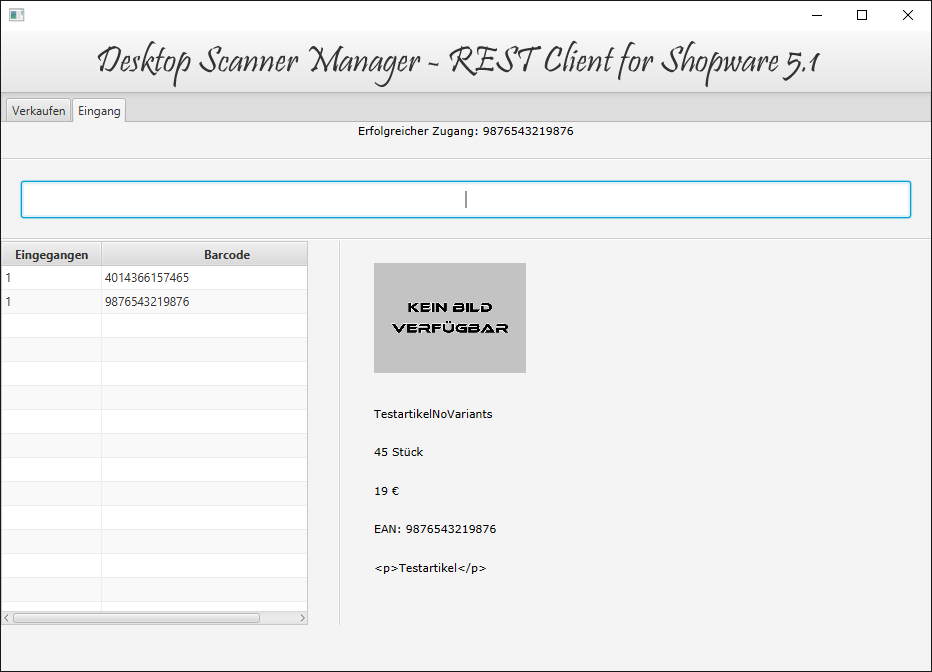

# Desktop Scanner Manager
## Restclient for Shopware 5

Current supported Shopware Version: 5.1.2

This Application is using the REST-API of an Shopware 5 store to update the stock of an article.
This can be done, by scanning the article-barcode by e.g. an external usb-scanner.

### Functions
The following Functions are supported:
 - :+1: incoming (buy) and outgoing (sell) articles
 - :+1: grafical user interface by JavaFX2
 - :+1: history listing of scanned articles
 - :+1: support of articles and variants of articles
 - :+1: article details of scanned products
 - :+1: error handling on entering a code
 

### Gui

### Getting started

To run the Application:

	1. clone Project
	2. import as Maven Project
	3. enter authentication data and domain to autheticationData.properties
	4. copy 'dummyImage.jpg' to root-folder of your domain (this is necessary to show an Image if the article does not support one)
	5. run application in ide or after a maven build process as standalone
	
Shopware 5 must be installed and the articles, which have to be scanned, need the EAN-Number of the barcode set as Articlenumber and as EAN-Number. This has to be done, because the Shopware 5 Rest API only allows the article-identification by ID and Articlenumber. (not by ean)

### LICENCE

	MIT